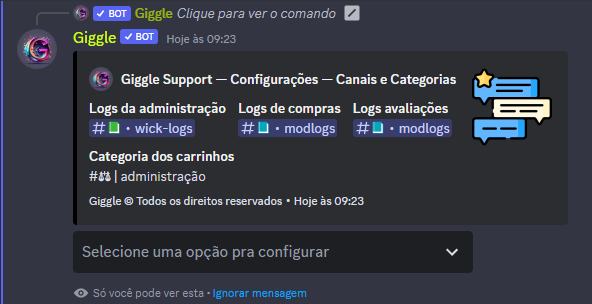

## Introdução

Primeiramente vá até as configurações do servidor ( /config ), e navegue até a opção **canais e categorias**, ao selecionar a opção, aparece a seguinte mensagem

Agora ao clicar no menu, basta selecionar o canal que deseja configurar no sistema, e ao salvar o mesmo será atualizado automatico

<Warning>O canal de logs da staff foi desativado temporariamente</Warning>