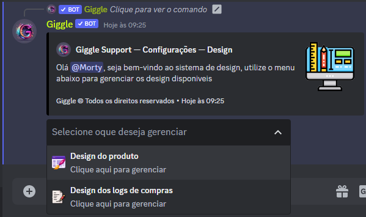
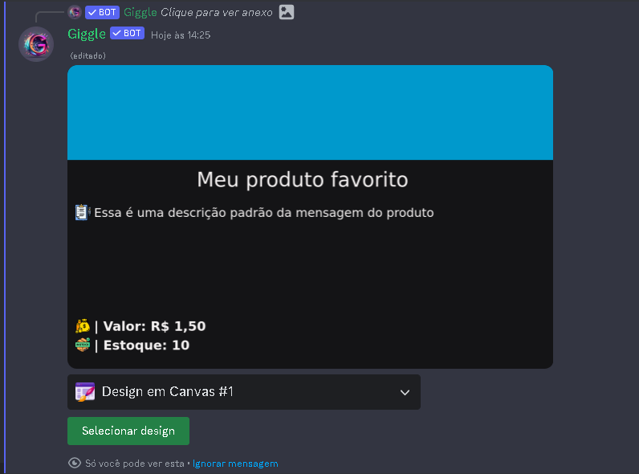
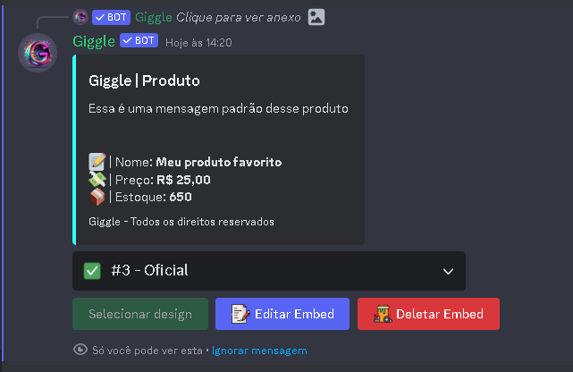
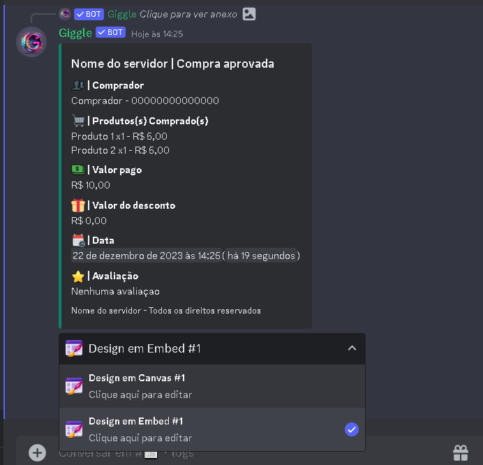
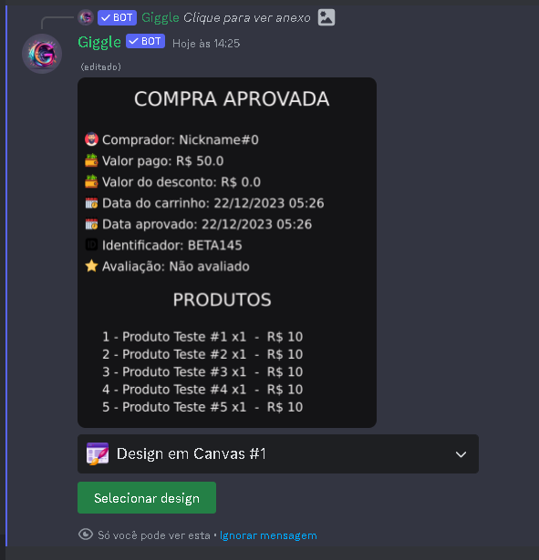

## Introdução

Primeiramente vá até as configurações do servidor ( /config ), e navegue até a opção **Design**, ao selecionar irá exibir a seguinte mensagem

## Design dos produtos

Ao selecionar o menu design dos logs será exibido a mensagem

Por padrão o **Giggle** têm 2 design pré configurados, 1 em canvas e 1 embed, para escolher embed basta clicar no design em embed

E ao clicar em **Selecionar design**, o design padrão ao criar um produto será atualizado

## Design dos logs

Ao selecionar o menu design de produto será exibido a mensagem

Por padrão o **Giggle** têm 2 design de logs pré configurados, 1 em canvas e 1 embed, para escolher embed basta clicar no design em embed e clicar em selecionar design

