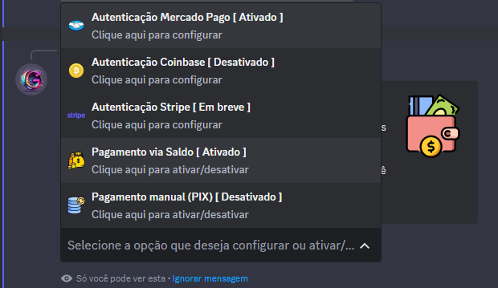
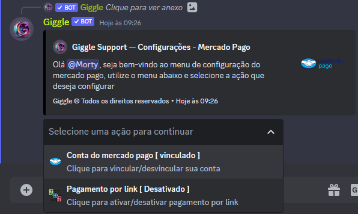
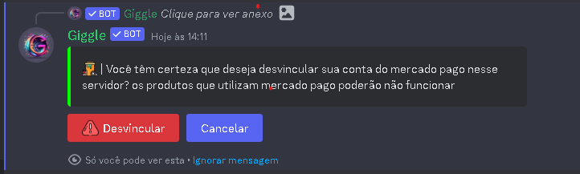
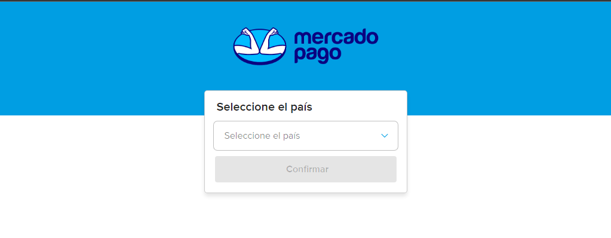
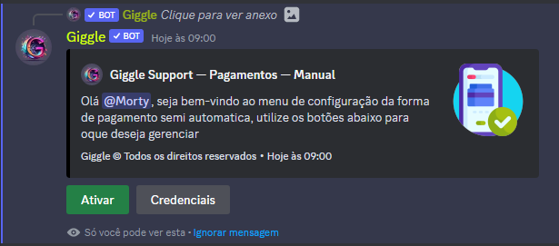
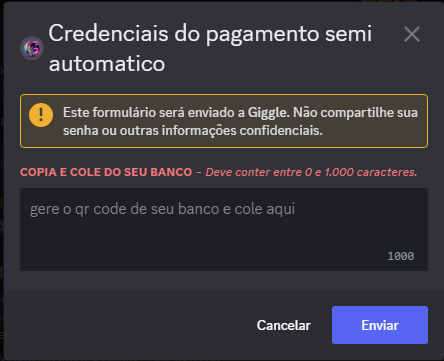

## Introdução

Primeiramente vá até as configurações do servidor ( /config ), e navegue até a opção **Formas de pagamentos**, ao selecionar irá exibir a seguinte mensagem

Abaixo está uma breve explicação sobre cada forma de pagamento

<Tabs>
  <Tab title="Mercado Pago">
    Essa é a forma de pagamento mais utilizada no bot, com ela você pode fazer vendas 100% automatizadas na sua loja

    ## Configurando o Mercado Pago

    Com o painel de formas de pagamentos aberto, clique na opção mercado pago

    

    Ao clicar na opção **Conta do mercado pago**, sera exibido a mensagem

    

    Ao clicar no botão para se autorizar, você será redirecionado ao site do mercado pago

    

    Agora so basta selecionar o seu país e clicar em continuar e pronto, mercado pago foi vinculado ao seu servidor

    <Note>Não é possivel habilitar a forma de pagamento semi automatica e automatica juntas nos produtos</Note>    
  </Tab>
  <Tab title="Semi automatico">
    Com essa forma de pagamento você têm total controle sobre suas transaçõe0s. No entanto, você precisará aprovar manualmente as compras realizadas.

    ## Configurando o pagamento semi automatico

    Com o painel de formas de pagamentos aberto, clique na opção manual (PIX)  

    

    Clique no botão ativar e posteriomente clique em gerenciar, será exibido a seguinte modal

    

    <Note>O Qrcode do carrinho de compras não irá funcionar se você informar uma chave aleatoria (PIX)</Note>    
  </Tab>
  <Tab title="Coinbase">
    Com essa forma de pagamento você poderá receber pagamentos automaticos em criptomoedas
    <Warning>A Forma de Pagamento <strong>Coinbase</strong> foi desativado!!</Warning> 
  </Tab>  
  <Tab title="Saldo">
    Saldo é uma forma de pagamento interna no **Giggle**, você pode adicionar saldo a conta do usuario utilizando **/saldo adicionar**
  </Tab>    
</Tabs>