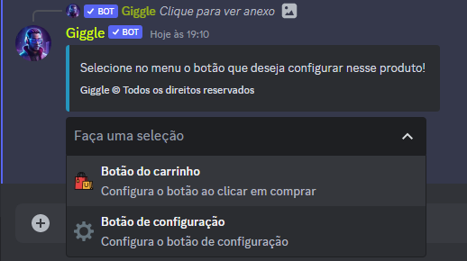
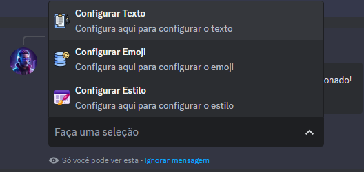
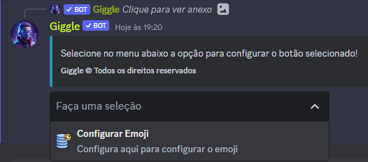

## Introdução

Primeiramente vá até as configurações do produto que deseja atualizar os botões, e navegue até a opção botões, ao selecionar a opção, aparece a seguinte mensagem

Agora selecione o menu para configurar o botão desejado

<Tabs>
  <Tab title="Botão do carrinho">
    Nessa sessão você irá ver como configurar o botão de adicionar ao carrinho

    

    Agora basta selecionar o menu pelo que queira editar no botão, e após editar basta clicar pra enviar ou salvar
  </Tab>
  <Tab title="Botão de configuração">
    Nessa sessão você irá ver como configurar o botão de configurações
    
    

    Agora basta selecionar o menu pelo que queira editar no botão, e após editar basta clicar pra enviar ou salvar
  </Tab>
</Tabs>
