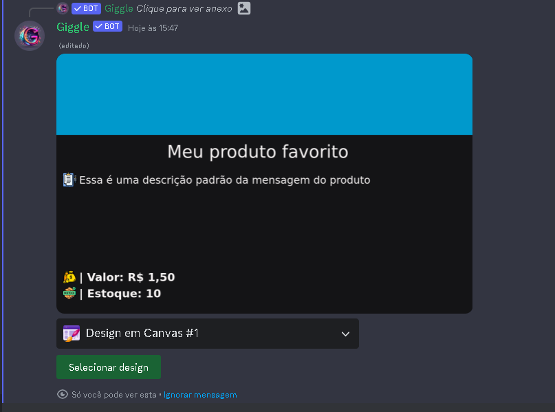

## Introdução

Primeiramente vá até as configurações do produto que deseja trocar o design, e navegue até a opção design, ao selecionar a opção, aparece a seguinte mensagem

<Tip>As embeds personalizadas tambêm aparecerão no menu de design do produto</Tip>

Ao clicar no design escolhido, será exibido uma mensagem de confirmação de troca de design

Agora basta clicar em selecionar design, que o produto será atualizado automaticamente para o design escolhido

