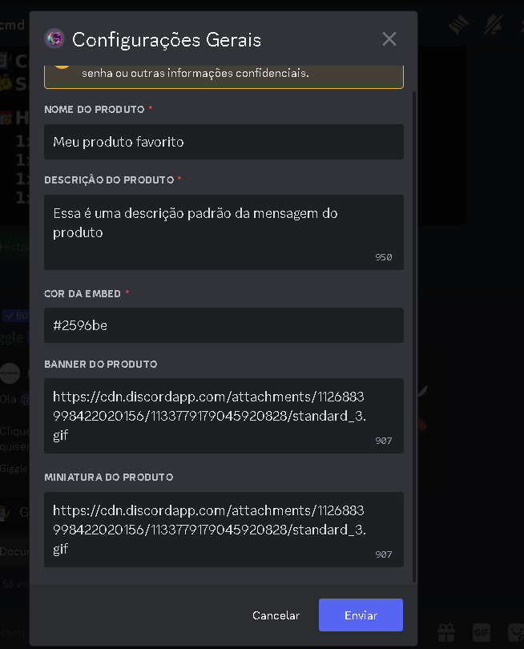

## Introdução

Primeiramente vá até as configurações do produto que deseja desbloquear, e navegue até a opção gerais, ao selecionar, será aberto a seguinte modal

Nessa modal você poderá editar o nome, descrição e o banner do produto. Ao clicar em enviar, o produto será salvo e atualizado automaticamente com as informações inseridas

<Note>O banner do produto so aceita formatos: (png, jpeg e gif),
para funciona perfeitamente, apague tudo dps do .png | .gif | .jpeg </Note>