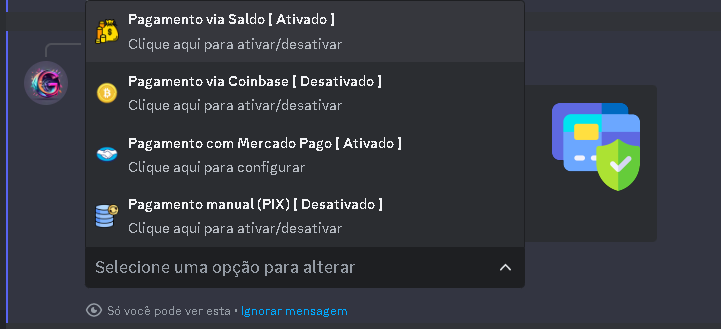

## Introdução

Primeiramente vá até as configurações do produto que deseja configurar as formas de pagamento, e navegue até a opção formas de pagamento, ao selecionar a opção, aparece a seguinte mensagem

Agora basta você selecionar a forma de pagamento que deseja no produto e a mesma será ativada ou desativada imediatamente

<Note>Para ativar a forma de pagamento via mercado pago, é obrigatorio vincular uma conta do mercado pago no servidor utilizando o /config.
não importa, se for Mercado pago kids ou Adulto vai funcionar do mesmo jeito.</Note>

<Warning>Forma de pagamento <strong>Coinbase</strong> esta Indisponivel temporiaramente.</Warning>