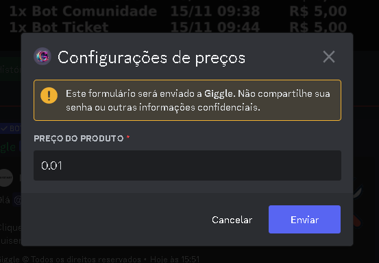

## Introdução

Primeiramente vá até as configurações do produto que deseja atualizar o preço, e navegue até a opção preços, ao selecionar a opção, aparece a seguinte mensagem

Ao configurar o valor e clicar em enviar, o preço e a mensagem do produto serão atualizados automaticamente

<Note>Por motivos de segurança, o Giggle limita o valor do produto entre R$ 0.01 e R$ 500.00</Note>