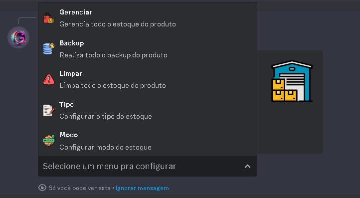

## Introdução

Primeiramente vá até as configurações do produto que deseja configurar o estoque, e navegue até a opção estoque, ao selecionar a opção, aparece a seguinte mensagem

Nessa seção, Você vai puder Escolher qual tipo do Estoque <strong>Texto</strong> ou <strong>Arquivo</strong>, o Modo do Estoque <strong>Replicado</strong> ou <strong>Unico</strong> e muito mais.

<Tabs>
    <Tab title="Gerenciar">
    ## Gerencie todo o estoque do produto

    ## MODO REPLICADO 

    

    Vamos primeiro, fazer a quantidade de vezes que o produto vai ser vendido - isso acontece so quando esta no modo replicado, mas se estiver no modo <strong>Unico</strong> vai ser como da seguinte imagem
    
    

    ainda no modo replicado, vamos fazer colocar o produto que vai ser vendido.

    

    ## MODO UNICO

    No Modo unico, cada linha é um Produto, exemplo:
    
    
 
</Tab>
    <Tab title="Backup">

    ## Realize o Backup de todo o estoque

    

</Tab>
    <Tab title="Limpar">

    vai limpar todo o estoque do produto de maneira permanente.
    

</Tab>
    <Tab title="Modos">

    
    ## Replicado

        no modo replicado, você so vai precisar colocar o produto uma vez, e colocar quantas vezes o produto vai ser vendido.

        

    ## Unico

        No modo Unico, ao contrario do modo replicado voce vai precisar colocar o produto varias vezes, olhe a imagem abaixo, esse é um exemplo de como deve ser colocado os produto no modo unico

        
</Tab>
    <Tab title="Tipos">

    No tipo texto, voce so vai colocar o texto, exemplo:

    

    Modo Arquivo, é quase igual ao modo replicado, primeiro vamos colocar quantas vezes o produto vai ser vendido

    

    no <strong>Adicionar Produto (Arquivo)</strong> faz como na imagem abaixo!!

    
    
</Tab>
</Tabs> 
<Warning>Para ativar a forma de pagamento via mercado pago, é obrigatorio vincular uma conta do mercado pago no servidor utilizando o /config</Warning>