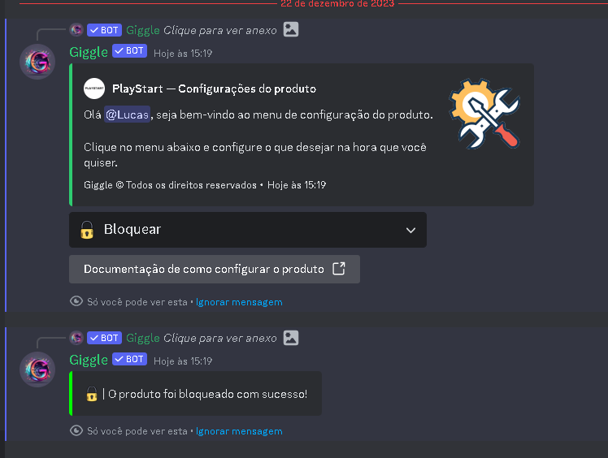

## Introdução

Primeiramente vá até as configurações do produto que deseja desbloquear, e navegue até a opção desbloquear ou bloquear, ao selecionar a opção, o produto será automaticamente bloqueado ou desbloqueado

<Note>Com o produto bloqueado, nenhum membro do servidor poderá adicionar o produto ao carrinho</Note>