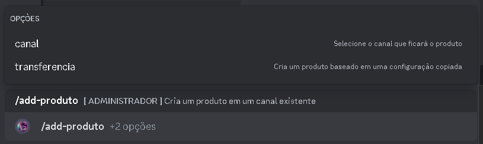

<Warning>Antes de tudo, certifique-se que o Giggle possui a permissão de gerenciar canais e gerenciar mensagens,
<strong>Recomendamos que Você der permissão de Administrador.</strong></Warning>

## Introdução
<Tabs>
    <Tab title="Criação">
      Utilize o comando <strong>/add-produto</strong> e selecione o canal que ficará o seu produto, logo apos enviar o comando, o giggle criará automaticamente seu produto

      

      Ultilize o comando <strong>/criar-painel</strong> para a criação de um painel de multi produtos, selecione o tipo que voce que criar tem, como criar painel de ticket, produto e Renovação.

      

    <Note> Painel de Renovação, ainda não esta disponivel</Note>
</Tab>
    <Tab title="Transferencia">
     Caso voce queira Transferir um produto para outro canal ou lugar, use a <strong>Transferencia</strong>
     
     <strong>em breve vai ter video</strong>
     
 </Tab>
</Tabs>