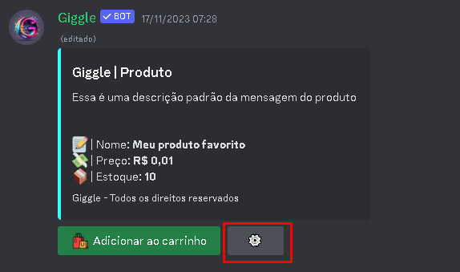
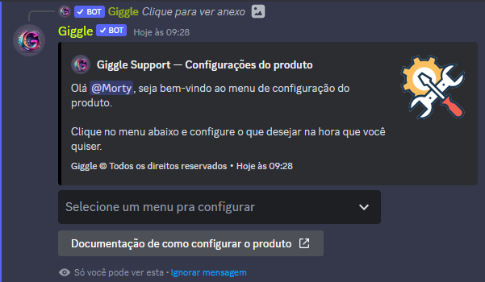
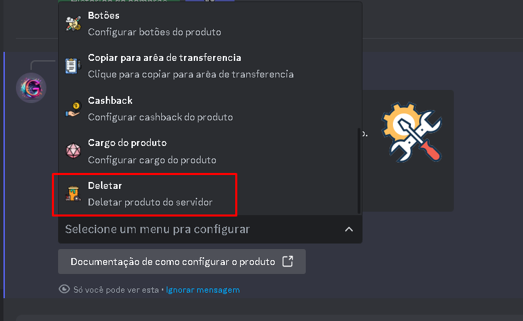

## Introdução

Com o produto devidamente criado no servidor, utilize o botão de configurações

Após clicar no botão de configurações, será aberto uma mensagem com um menu e todas as configurações do produto

Agora, basta navegar na opção **Deletar**, ao selecionar será aberto a seguinte mensagem e ao clicar no botão deletar, o produto será automaticamente deletado do servidor

<Warning>Ao deletar um produto, todo o estoque disponível será deletado e todas as configurações</Warning>